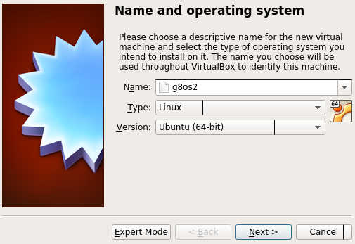
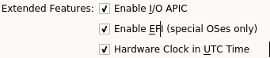
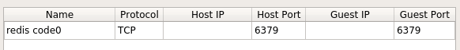

# Start a core0 in a virtual box virtual machine

1. First you need to build the initramsfs. see the [initramfs README.md](https://github.com/g8os/initramfs/blob/master/README.md) to know how to proceed.

2. Creates a bootable disk image with the initramfs created in previous step:
```shell
dd if=/dev/zero of=g8os.img bs=1M count=64
mkfs.vfat g8os.iso
mount g8os.iso /mnt
mkdir -p /mnt/EFI/BOOT
cp staging/vmlinuz.efi /mnt/EFI/BOOT/BOOTX64.EFI
umount /mnt
```
3. Create a new virtual machine on virtual box  
Select a linux 64bit:  
  
Before starting the vm make sure you enabled the EFI support in the settings of the VM:  
  
4. create a port forward from the VM to your host to expose the redis of the core0:

5. Start the VM. Use the disk created a step 2 as boot disk.
6. Try to ping the core0 using the python client
```python
from g8os.client import Client
cl = Client(self, host, port=6379, password='')
cl.ping() # this should return 'pong'
```
